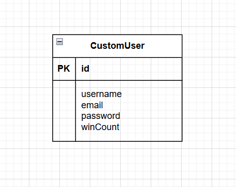

# じゃんけんゲームポートフォリオ

Spring Boot + Bootstrap の組み合わせで開発したじゃんけんゲームです。  
プレイヤー登録・ログイン機能、じゃんけん対戦、勝利数の自動記録、ランキング機能を備えています。  
Bootstrapを用いた直感的なUIと、Spring Bootによるシンプルで安全性のあるバックエンドロジックにより、実用的な構成を目指しました。

サイトURL：https://janken-game-mfb5.onrender.com/

---

## 📝 開発の背景

転職に向けたスキル強化の一環として、Javaの開発スキルの習得を目指しました。まずはJavaの基礎から応用までを体系的に学ぶため、Java Programmer Silver、およびJava Programmer Goldの資格を取得し、開発に必要な知識を身につけました。  
しかし、資格だけでは志望企業に対する十分なアピールにならないと感じたため、資格学習で得た知識を活かして実践的なWebアプリケーションの開発に取り組みました。  
また、私自身テレビゲームが趣味であり、以前から「自分でもゲームを作ってみたい」という思いがあったため、シンプルではありますが、じゃんけんゲームという題材で開発に挑戦することにしました。Javaの学習成果を形に残すと同時に、楽しく学びながら開発できる題材として適していると考えました。

---

## 🎯 開発の目的

- Javaを用いたWebアプリケーションの開発経験を積む。
- Javaの主要フレームワークであるSpring Bootの基本的な構成や使い方に慣れる。
- スクラッチでの開発を通じて、Spring BootのMVC構成・テンプレートエンジン(Thymeleaf)・セキュリティ機能等の理解を深める。
- Java Programmer Silver / Goldの資格で得た知識をもとに実践的なWebアプリを開発し、実務レベルのスキルを持っていることを企業にアピールする。

---

## 🔧 使用技術・スペック

- 言語：Java 24.0.1
- フレームワーク：Spring Boot 3.5.0
- フロントエンド：HTML5 / CSS3 / Bootstrap 5.3.3 / JavaScript
- データベース：PostgreSQL(Render提供のデータベースを使用)
- デプロイ：Render
- 認証：Spring Security
- バージョン管理：GitHub
- 開発環境：Windows11 / VSCode
- その他使用ツール：DBeaver(RenderではWeb UIなどを使って直接データベースを開く機能が無いため)

---

## 🖥 主な機能

| 機能              | 説明 |
|-------------------|------|
| プレイヤー登録・ログイン・ログアウト | Spring Securityを使った認証機能 |
| じゃんけん対戦機能 | ボタンをクリックして「グー・チョキ・パー」で対戦可能 |
| 勝敗判定処理 | 対戦結果(勝ち・負け・あいこ)を画面上に表示 |
| 勝利数の自動記録 | 勝利時にプレイヤーの勝利数をDBに自動保存 |
| 勝利数ランキング機能 | 登録プレイヤーの勝利数を降順で表示するランキング画面 |
| レスポンシブ対応   | Bootstrapによるスマホ対応 |

---

## 🚀 開発手順
1.要件定義

じゃんけんゲームに主に必要となる機能を考え、実装する。
- プレイヤー情報の登録
- プレイヤーのログイン、ログアウト
- ログインプレイヤー名の画面表示
- じゃんけんのプレイ機能
- 勝敗判定ロジックと、その結果の画面反映
- 勝利時の勝利数記録
- プレイヤーごとの勝利数ランキング機能
- BootstrapによるUIの整備(スマホ画面対応含む)
- ゲームというテーマを意識したアニメーション演出


2.環境選定
- フレームワークは、Webアプリケーションを効率的に開発できるSpring Bootを採用。認証機能やMVCモデルといったWeb開発に必要な機能が揃っており、初学者にも学習・開発しやすいフレームワークだと感じたため。
- 転職活動に向けたスキル強化として、JavaのSilver・Gold資格を取得。資格学習で得た知識を実践に活かすため、開発言語としてJavaを選択。また、Javaは業務システム開発での需要が高く、求人案件数としてもトップにあることを知り、今後のキャリアにも有用と考えたため。
- 開発に使用したプライベートPCがWindowsであったため、ローカル環境はWindows上に構築。
- 無料でWeb公開できるサービスを調査した結果、Renderは無料でのデプロイが可能で、操作も比較的シンプルだったため、本番環境として選定。


3.データベース設計

このアプリでは、プレイヤー情報の管理や勝利数の記録といった、じゃんけんゲームに必要な情報を扱うため、以下のようなシンプルかつ拡張性を意識したデータベース設計を行った(本番環境ではPostgreSQLを使用)。

🔑 プレイヤーモデル(User)
- janken_usersテーブルにマッピングされたエンティティ。
- 認証に使用する情報として、プレイヤー名、メールアドレス、パスワードを保持。
- Spring SecurityのUserDetailsインターフェースを実装し、認証機能として使用。
- じゃんけんの勝利数を保持しており、ゲーム結果に応じて加算される設計。
- 各フィールドにはnullable=falseやunique=trueを設定し、データの整合性を確保。

💡 設計の特徴
- 単一テーブル構成にすることで、最小限の構成で動作するシンプルなアプリを実現。
- 将来的に、例えば対戦履歴やレベル・称号などを追加し、ゲームとしての幅を広げたい場合でも拡張しやすい構造。


4.ER図作成

本ECサイトのエンティティ構造は以下の通り。  



5.コーディング
- フロントエンド：HTML、 CSS(Bootstrapを利用)、 JavaScript
- バックエンド：Java(Spring Boot)
- IDE：VSCode


6.テスト工程

単体テスト：
- プレイヤー登録時のバリデーションと登録処理の確認
- ログイン・ログアウト処理の動作確認
- 認証状態によるアクセス制限の確認
- じゃんけんボタンのクリック動作
- じゃんけんの結果表示の確認
- 勝敗判定ロジックの正確性
- 勝利数カウントの更新確認
- ランキングページの表示とソート順の確認(勝利数降順)
- 全体のページ遷移の正常動作確認
- エラーメッセージ・バリデーションメッセージの表示確認


結合テスト：
- 新規プレイヤー登録 → ログイン → じゃんけんプレイ → 勝利数記録 → ランキング反映までの一連の流れ
- ログイン必須画面(じゃんけん対戦、ランキング閲覧)へのアクセス制限動作の確認
- 勝敗結果がwinCountに正しく反映されるかのデータ整合性確認
- それぞれのプレイヤーの勝利数が正確に個別に記録されるかの確認

---

## 💪 開発で工夫した点(アピールポイント)

- **JavaScriptによるUX向上**：フェードアニメーションや簡単なじゃんけん演出をJavaScriptで実装し、ゲームらしい雰囲気と操作時の楽しさを演出。
```javascript
// じゃんけんアニメーション：手を選択すると、一度アニメーションが入り、勝負までのタメを演出。
function playWithAnimation(hand) {
    const jankenForm = document.querySelector('.janken-form');
    const animationArea = document.createElement('div');
    animationArea.className = 'mt-4';
    animationArea.innerHTML = `
        <h2>じゃんけん…</h2>
        <div style="font-size: 3rem;">✊ ✌️ 🖐️</div>
    `;
    jankenForm.replaceWith(animationArea);

    setTimeout(() => {
        window.location.href = `/play?hand=${encodeURIComponent(hand)}`;
    }, 2000);
}

// ウェルカム画面のフェードアウト演出：ログイン直後に「ようこそ」画面を表示 → 数秒後に自動でフェードアウトし、ホーム画面へ遷移。
function startWelcomeTransition() {
    const box = document.getElementById('welcomeBox');
    if (box) {
        setTimeout(() => {
            box.classList.add('fade-out');
            setTimeout(() => {
                window.location.href = "/";
            }, 1000);
        }, 4000);
    }
}

document.addEventListener("DOMContentLoaded", () => {
    startWelcomeTransition();
});
```
- **バリデーションの強化、およびエラー時のUX向上**：メールアドレスやパスワードに対して正規表現を使い、セキュリティを意識。また、入力エラーに対して説明を表示することで、プレイヤーが即座に問題を確認できるように対応。
```java
// メールアドレスの重複チェック
if (userRepository.findByEmail(email).isPresent()) {
    model.addAttribute("error", "このメールアドレスはすでに使用されています。");
    model.addAttribute("username", username);
    model.addAttribute("email", email);
    return "register";
}

// メールアドレスの形式チェック
if (!email.matches("^[A-Za-z0-9._%+-]+@[A-Za-z0-9.-]+\\.[A-Za-z]{2,}$")) {
    model.addAttribute("error", "有効なメールアドレス形式で入力してください。");
    model.addAttribute("username", username);
    model.addAttribute("email", email);
    return "register";
}
```
- **レスポンシブ対応**：Bootstrapを活用し、スマホ画面でも快適に操作可能なUIを実現。各ユーティリティクラスを用い、ボタン配置やテキストの中央寄せ、スペーシングなどを調整。
```html
<div class="container text-center">
    <form action="/play" method="get" class="janken-form">
        <div class="d-flex flex-column gap-2">
            <button class="btn btn-primary" type="button">✊ グー</button>
            <button class="btn btn-primary" type="button">✌️ チョキ</button>
            <button class="btn btn-primary" type="button">🖐️ パー</button>
        </div>
    </form>
</div>
```
- **セキュリティを意識したログイン機能**：Spring Securityを用い、メールアドレスとハッシュ化パスワードで認証を実装。資格試験においても紹介されていた、セキュリティ上の基本的な対策を適用。
```java
public User registerUser(String username, String email, String rawPassword) {
        String encodedPassword = passwordEncoder.encode(rawPassword); // パスワードをハッシュ化
        User user = new User(username, email, encodedPassword); // プレイヤーオブジェクト生成
        return userRepository.save(user); // DBに保存
}
```
- **勝利数ランキング機能の実装**：プレイヤーを勝利数で並べ替え、ランキング形式で表示。対戦感や競争意識を高めることで、ゲームに熱中しやすくなるよう工夫。資格学習にて学んだJava Stream APIを活用し、コレクションの並び替え処理をシンプルに記述。
```java
List<User> users = userRepository.findAll()
    .stream()
    .sorted((u1, u2) -> Integer.compare(u2.getWinCount(), u1.getWinCount()))
    .toList();
```
---

## 🔍 今後の課題・改善点

- **高度なアニメーションの追加**：現状、ゲームとしての臨場感や操作の気持ちよさを高めるアニメーションが少ないため、UX向上の余地があると感じています。今後はフロントエンドスキルをさらに磨き、例えばプレイヤーが勝利した際の「WIN」エフェクトや、じゃんけんの手の動きをCSSやJavaScriptで動かす演出を実装するなどして、よりゲームらしい体験ができるよう改善していきたいです。
- **オンライン対戦の実装**：現在はCPUとの対戦のみですが、リアルタイム性のある対人戦を目指し、Spring BootでのWebSocketを活用した非同期通信に挑戦したいと考えています。プレイヤー同士がマッチングするオンライン対戦の機能を開発することで、リアルタイム通信の技術理解を深めたいです。
- **データ分析要素の強化**：現在は勝利数ランキングのみを実装していますが、将来的には勝率、最も使用された手の傾向など、プレイヤーのプレイ履歴をもとにしたデータ分析機能を追加したいと考えています。これにより、プレイヤー自身が自分の傾向を振り返ることができ、ゲーム体験に深みを与えるとともに、開発している私自身としても、ログ分析や可視化のスキルが習得できると考えています。

---